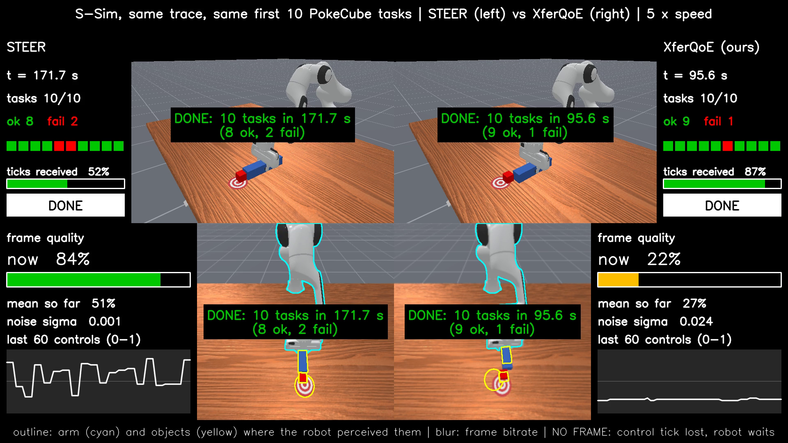
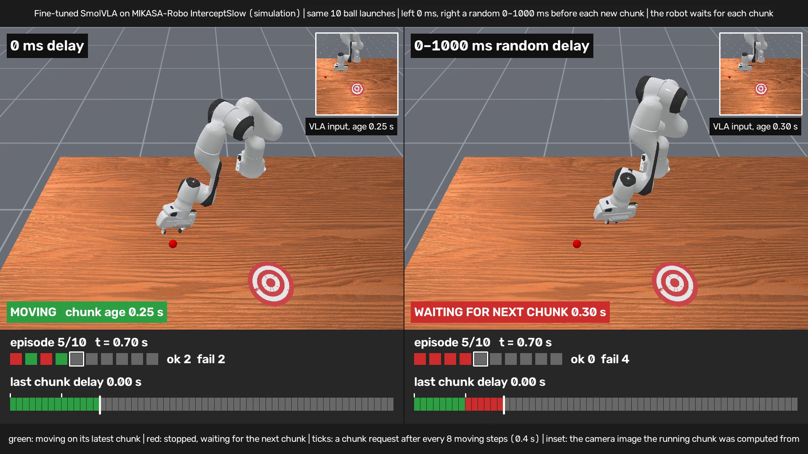

# Demo videos

Two short simulation videos: a robot controlled over a wireless link with two rate controllers, and a robot policy under network delay. Each picture opens a page that plays the video in the browser.

## 1. STEER vs. XferQoE on the same bandwidth trace (S-Sim)

[Play in the browser](https://sonny0714.github.io/demo_video_robot/xferqoe-vs-steer.html) · [video file](videos/xferqoe_vs_steer_ssim.mp4)

The edge server runs the robot policy and the rate controller, and only observations cross the wireless link. Both sides replay the same bandwidth trace in S-Sim, a packet-level network simulator, and run the same first 10 PokeCube tasks (ManiSkill3) with the same frozen robot policy; only the rate controller differs. 5× speed, 39 s. This is one example run out of 15, not the median one; over all 15 runs and all 40 tasks, XferQoE's task QoE is higher in 14.

- Left, STEER (a learning-based rate controller): mean frame quality 50.6%, a complete observation on 51.6% of the control ticks, 10 tasks finished in 171.7 s (8 succeeded, 2 failed).
- Right, XferQoE: mean frame quality 27.2%, a complete observation on 86.8% of the control ticks, 10 tasks finished in 95.6 s (9 succeeded, 1 failed).
- The end card gives the task QoE over the 10 tasks: 0.468 (STEER) vs. 0.767 (XferQoE).

## 2. Moving-ball task under network delay: 0 ms vs. 0–1000 ms

[Play in the browser](https://sonny0714.github.io/demo_video_robot/moving-ball-delay.html) · [video file](videos/moving_ball_delay_0ms_vs_0-1000ms.mp4)

A fine-tuned SmolVLA policy intercepts a moving ball (MIKASA-Robo InterceptSlow, simulation). Both sides see the same 10 ball launches. 0.75× speed, 52 s.

- Left: no delay.
- Right: every action-chunk request draws a uniform random delay of 0–1000 ms (the first chunk arrives immediately on both sides), and the robot waits for the new chunk before it moves (synchronous execution).

In this clip the left side succeeds on 5 of the 10 launches and the right side on none. Over all 200 evaluation episodes the success rates are 55.5% and 3.0%.
